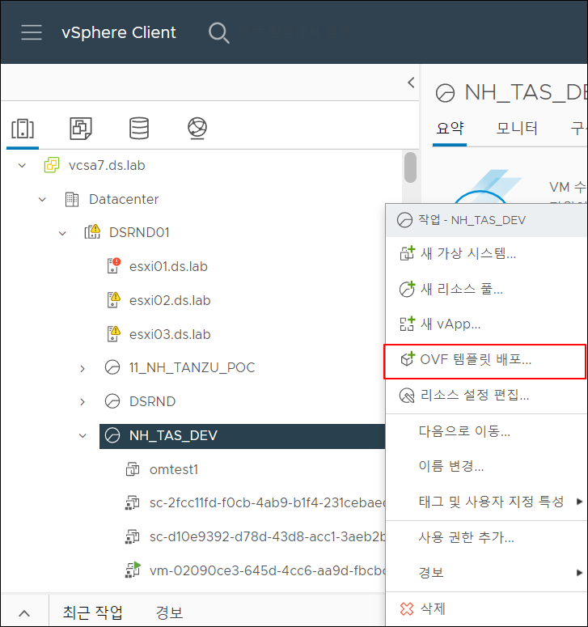
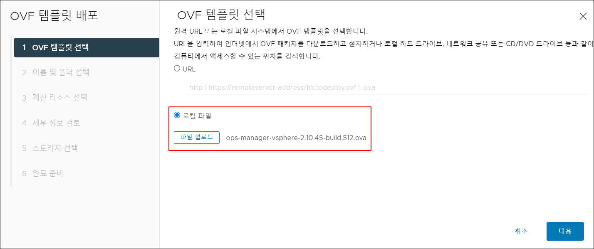
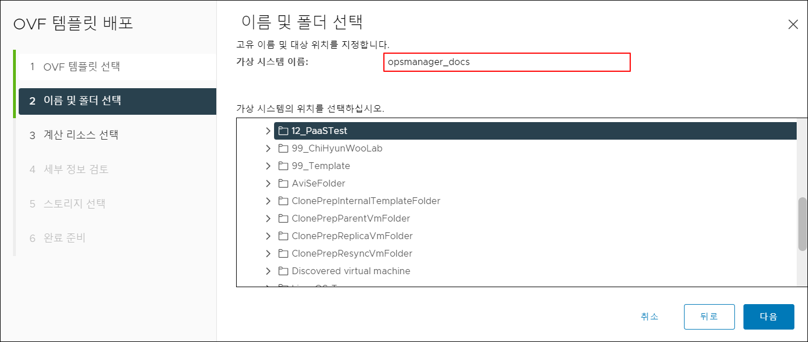
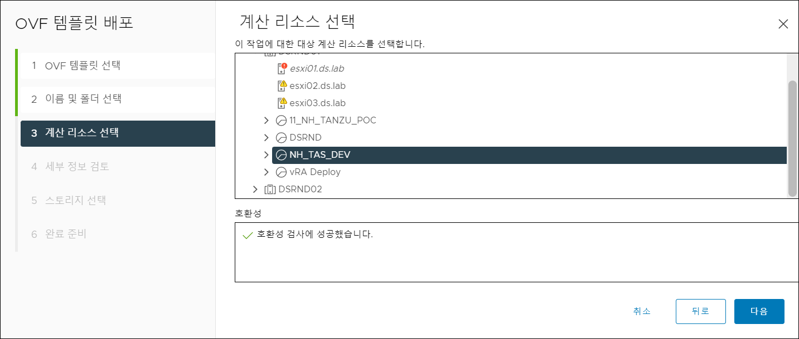
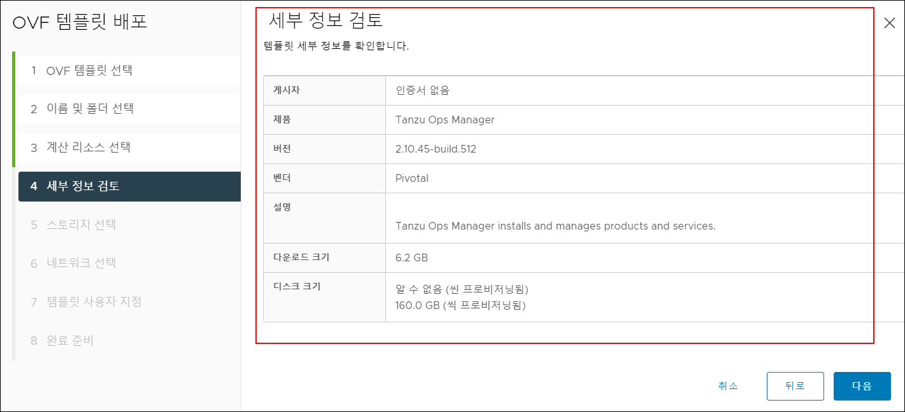
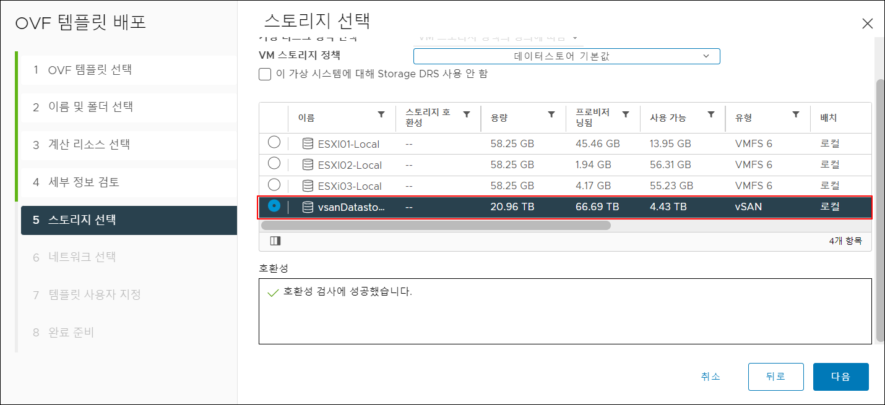
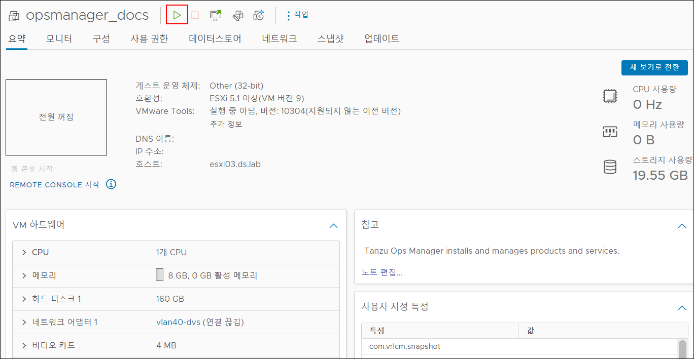
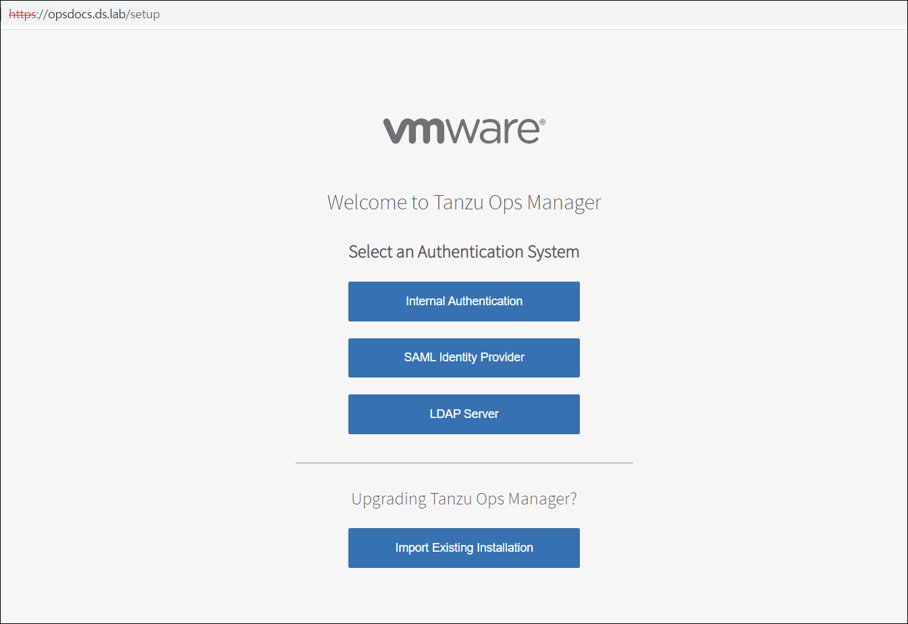
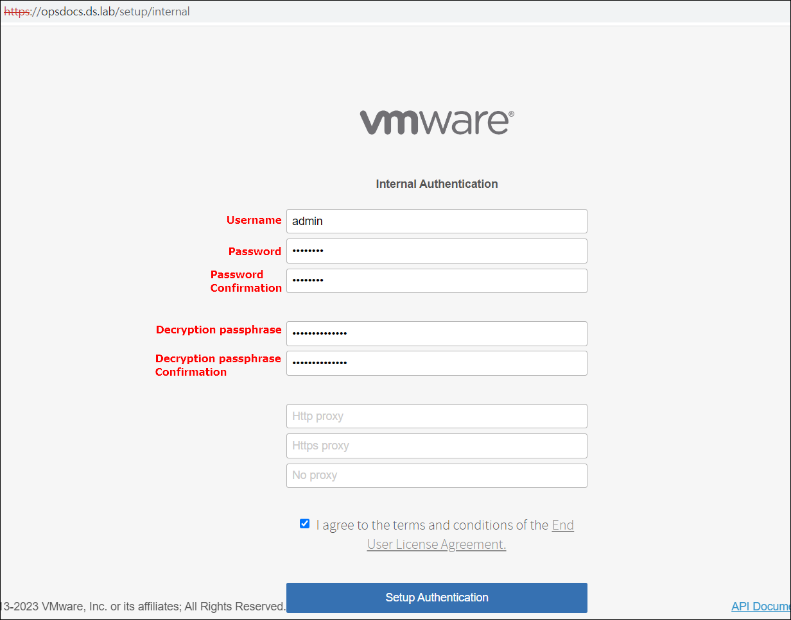
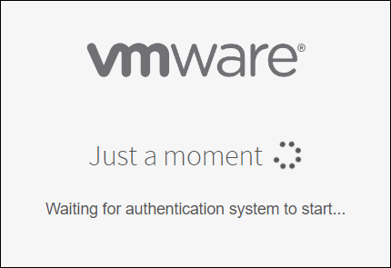

# 설치 방법

## Ops Manager 설치

* **[VMware Tanzu 네트워크](https://network.pivotal.io/) 에서 제품을 다운로드하십시오.**

1. 설치하고자 하는 Ops Manager release 버전을 선택하십시오.

2. Ops Manager가 설치 될 IaaS 환경에 맞는 파일을 선택하십시오.(본 매뉴얼은 vSphere 환경입니다.)

3. 설치하고자 하는 파일의 상세 정보를 확인하십시오.

4. 설치 시 Depends On을 확인하여 의존 관계가 존재하는지 확인하십시오.

* **vSphere에 Ops Manager.ova 파일을 설치합니다.**

* **Ops Manager 설치를 위해 설정을 진행합니다.**

다운 받은 opsmanager.ova 파일을 업로드합니다.

 

환경에 맞는 설정 값을 입력 후 배포합니다.(위 캡쳐 사진은 예시입니다.)

* **Ops Manager 설치가 완료되면 VM을 기동합니다.**

* **Ops Manager에 접속합니다.**

※*DNS에 Ops Manager 정보를 등록하여 domain으로 접속합니다.*

로그인 방법 및 인증 선택은 다음과 같습니다. 

        - **Internal Authentication:** Ops Manager는 사용자 데이터베이스를 유지하고 관리합니다.(본 매뉴얼에서는 해당 방법을 사용합니다.)

        - **SAML Identity Provider:** SAML ID 서버가 사용자 데이터베이스를 유지 관리합니다.

        - **LDAP Server:** LDAP 서버가 사용자 데이터베이스를 유지합니다.

- 설정 값을 입력 후 **Setup Authentication**을 클릭합니다.

위에서부터 Username, Password, Password confirmation을 작성합니다. 

Decryption passphrase 및 Decryption passphrase Confirmation을 입력합니다. 

해당 암호는 Ops Manager 데이터 저장소를 암호화 합니다.

또한 HTTP 프록시 또는 HTTPS 프록시를 사용할 경우 알맞은 설정 값을 입력합니다.

End User License Agreement 체크 박스를 선택 후 **Setup Authentication**을 클릭합니다.

* Just a moment 창이 보이면 모든 설정이 될때 까지 잠시 기다립니다.

* Ops Manager의 모든 설정이 완료 되었다면 로그인 창이 보이게 됩니다. 

Setup 시 설정한 Username /  Password를 입력합니다.

- 로그인을 성공하면 아래와 같은 화면이 보이게 됩니다.

Ops Manager 설치 시 BOSH Director 타일은 기본을 설치됩니다. BOSH Director 타일 설정을 진행합니다.

